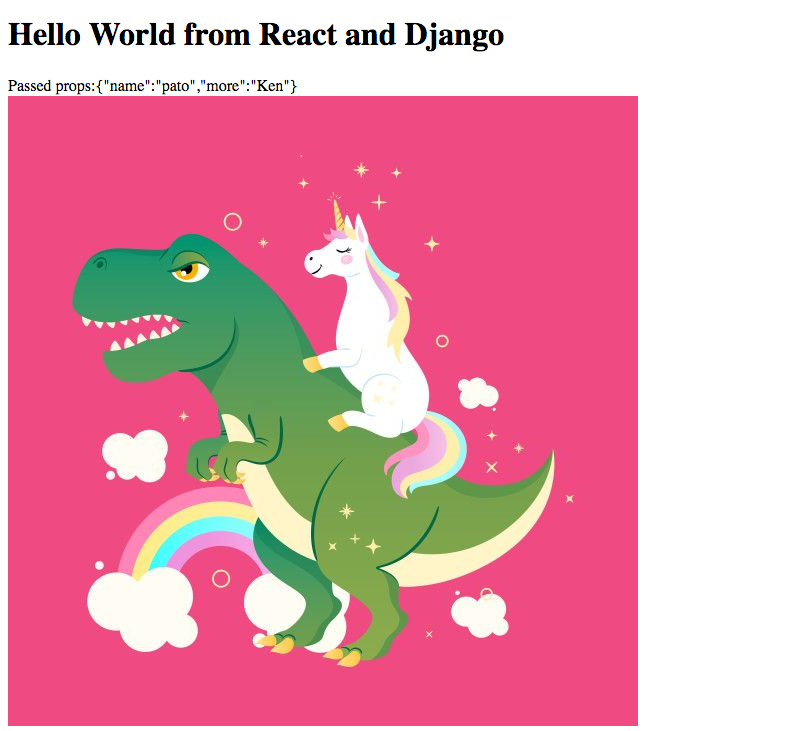

# React and Django integration Hello World

Complimentary code for our talk at DjangoCongress JP 2019.


To run example application on `localhost:8000`:
```
cd webapp
pip install -r requirements.txt
python manage.py runserver 8000
```



[Dinocorn Image Credit](https://www.teepublic.com/t-shirt/2886691-unicorn-riding-on-dinosaur)


To rebuild frontend code run:
```
cd frontend
yarn install
yarn build
```
Webpack will watch the Javascript source files and rebuild upon changes.
